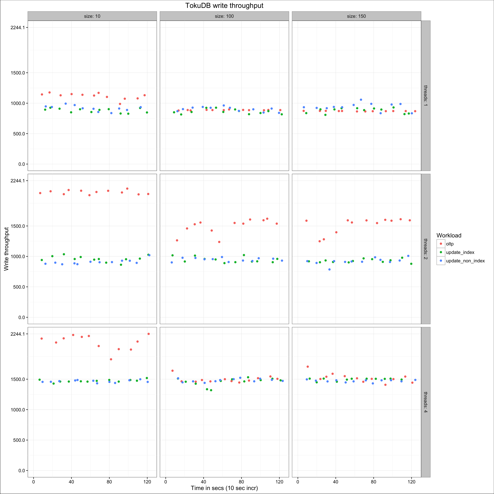
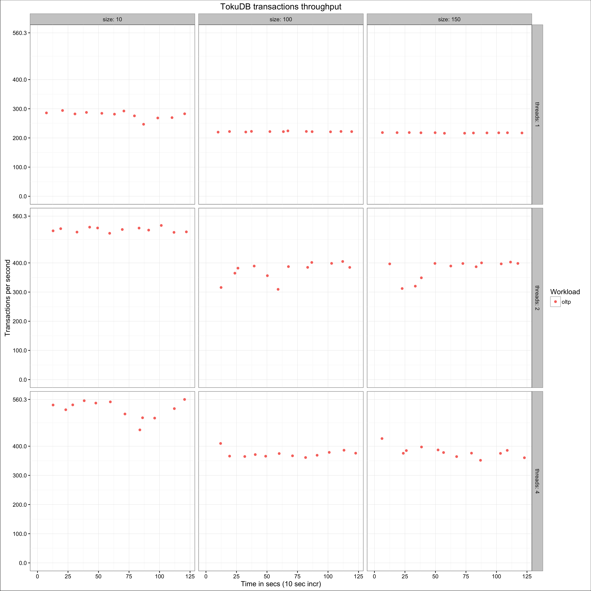

# Full sysbench example

This example shows how to run a series of sysbench based experiments, and generate a few graphs from the resulting data.

# Running the experiments

The following snippet runs the oltp, update\_index and update\_non\_index sysbench tests on 1, 2 and 4 threads, for 10, 100 and 150 table sizes: 

	env _TESTS_PATH=/usr/share/doc/sysbench/tests/db/ _EXP_NAME=sample _TESTS="oltp update_index update_non_index" _THREADS="1 2 4" _SIZE="10 100 150" ./run_sysbench.sh --oltp_tables_count=2 --mysql-user=sysbench --mysql-password=sysbench --mysql_table_engine=innodb --rand-type=pareto --rand-init=on --report-interval=10 --mysql-db=sbtest --max-time=120 --max-requests=0

Those values are not meant to represent a realistic production benchmark, but instead something that is lightweight enough to run on any laptop in a reasonable amount of time, yet still yielding results that let you test the scripts.

Note the './' at the script invocation, all the examples on this page assume they are run from the benchmark_wrappers directory of this repo. 

# Generating the csv output

This code generates a single csv file with the result from all experiments:

	. ../data_preparation_scripts/utils.sh
	../data_preparation_scripts/csv_from_sysbench.sh /dev/null _dummy _dummy > ../alldata.csv # /dev/null as readable file to get the headers bypassing the -r test.  
	for test in oltp update_index update_non_index; do  # I am not doing update_* so I don't need to remove the trailing '/' in each dir name ...
	   pushd $test
	   for f in sample*; do
		  export_fields_from_sysbench_wrapper_generated_file $f test 
		  echo "env _NOHEADER=1 ../../data_preparation_scripts/csv_from_sysbench.sh $f $_workload $_size $_threads >> ../../alldata.csv"
		  env _NOHEADER=1 ../../data_preparation_scripts/csv_from_sysbench.sh $f $_workload $_size $_threads >> ../../alldata.csv
	   done
	   popd
	done

# Generating the graphs

This generates a graph representing write throughput for all experiments, faceted by number of threads and table size:

	env _INPUT_FILE=../alldata.csv _OUTPUT_FILE=../write_throughput_all.png _FACTOR=workload _FACTOR_LABEL=Workload _X_AXIS=ts _X_AXIS_LABEL="Time in secs (10 sec incr)" _Y_AXIS=writes _Y_AXIS_LABEL="Write throughput" _GRAPH_TITLE="TokuDB write throughput" _FACET_X=threads _FACET_Y=size ../data_presentation_scripts/csv_to_png.sh

The resulting file for my test is here:  

Now let's generate a tps graph for the oltp experiment, faceted again by threads and size:

    head -1 ../alldata.csv > ../oltp.csv
    grep ^oltp, ../alldata.csv >> ../oltp.csv
	env _INPUT_FILE=../oltp.csv _OUTPUT_FILE=../oltp.png _FACTOR=workload _FACTOR_LABEL=Workload _X_AXIS=ts _X_AXIS_LABEL="Time in secs (10 sec incr)" _Y_AXIS=tps _Y_AXIS_LABEL="Transactions per second" _GRAPH_TITLE="TokuDB transactions throughput" _FACET_X=threads _FACET_Y=size ../data_presentation_scripts/csv_to_png.sh

The resulting fule for my tests is here: 
